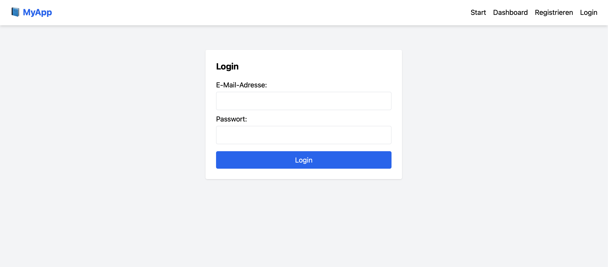

# 📌 frontend-se

Eine vollständige **React + Supabase** Webanwendung zur Verwaltung von Software-Engineering-Projekten im Hochschulkontext.  
Dieses Projekt ist Teil eines dreiteiligen Systems zur Unterstützung von Studierenden und Tutor:innen bei SE-Projekten.  
In Kombination mit **html-template-se** (Projektvorlage) und **se-tools** (Bash-Toolset) lassen sich Projekte automatisiert und vorkonfiguriert verwalten.

---

## ✨ Funktionen

### 👩‍🎓 Für Studierende
- Eigene Projekte anlegen, bearbeiten und löschen
- Meilensteine definieren, verwalten und mit Dateien versehen
- Kommentare schreiben und lesen
- Persönliche Projektdaten und Dateien verwalten

### 👨‍🏫 Für Tutor:innen
- Live-Übersicht aller studentischen Projekte
- Einsicht in Meilensteine, Dateien und Kommentare
- Reine Leserechte, keine Bearbeitungsmöglichkeit

---

## 🖼️ Screenshots

### 🔍 Dashboard


### 🧩 Projektübersicht


### 🔐 Login


---

## 🛠️ Technologien

- **Frontend**: React (Vite, TailwindCSS, React Router)
- **Backend**: Supabase (PostgreSQL, Auth, RLS Policies, Storage)
- **Deployment**: [Vercel](https://vercel.com/) mit `.env`-Konfiguration
- **Versionsverwaltung**: GitHub

---

## 📂 Projektstruktur

```plaintext
frontend-se/
│── public/                # Statische Assets
│── src/
│   ├── components/        # Wiederverwendbare UI-Komponenten
│   ├── pages/             # Hauptseiten (Dashboard, Login, etc.)
│   ├── utils/             # Hilfsfunktionen
│   ├── supabaseClient.js  # Supabase-Verbindung
│   └── App.jsx
│── supabase/              # Tabellen- & Policy-Definitionen (.json)
│── .env.example           # Beispiel für Umgebungsvariablen
```

---

## ⚙️ Lokale Installation

1️⃣ Repository klonen  
```bash
git clone https://github.com/RusmirOmerovic/frontend-se.git
cd frontend-se
```

2️⃣ Abhängigkeiten installieren  
```bash
npm install
```

3️⃣ `.env`-Datei erstellen  
```env
VITE_SUPABASE_URL=deine_supabase_url
VITE_SUPABASE_ANON_KEY=dein_anon_key
VITE_SUPABASE_SERVICE_ROLE=dein_service_role_key
```

4️⃣ Lokalen Dev-Server starten  
```bash
npm run dev
```

---

## 🚀 Deployment

**Frontend ist vollständig Vercel-kompatibel.**

1. Neues Projekt in Vercel anlegen  
2. GitHub-Repo verbinden  
3. `.env`-Werte in Vercel unter Environment Variables eintragen  
4. Deploy starten – fertig!

---

## 🛡️ Sicherheit

- Supabase-RLS schützt alle Datenbanktabellen
- Tutor:innen erhalten ausschließlich Leserechte
- Studierende sehen und verwalten nur ihre eigenen Inhalte
- Der `service_role_key` darf **niemals** im Browser 
  verwendet werden (.gitignore-Datei verwenden!)

---

## 👥 Mitwirkende

- 👨‍💻 Michael Weber – Projektleitung  
- 🧩 Niklas Theiler – Systemarchitektur  
- 🔧 Rusmir Omerovic – Automatisierung & Testing

---

## 📄 Lizenz

Dieses Projekt ist unter der **MIT-Lizenz** veröffentlicht – freie Nutzung & Anpassung erlaubt.

---

## 💡 Teil des Gesamtprojekts

**frontend-se** ist einer von drei Bestandteilen eines vollständigen Systems für SE-Projektmanagement:

1. `frontend-se` – Benutzeroberfläche & Verwaltung (React + Supabase)  
2. `html-template-se` – Projektvorlage mit CI/CD & Docker  
3. `se-tools` – Lokales Bash-Toolset für Automatisierung & Verwaltung
